# MOI : Movie and Review

> MOI disusun untuk memenuhi Tugas Besar - Milestone 1 IF3110 Pengembangan Aplikasi Berbasis Web. Tugas besar ini berfokus pada pembuatan web menggunakan Monolithic PHP & Vanilla Web Application.

## Daftar Isi

-   [Deskripsi Aplikasi _Web_](#deskripsi-aplikasi-web)
-   [Peran dan Fitur](#peran-dan-fitur)
-   [Struktur Program](#struktur-program)
-   [Daftar _Requirement_](#daftar-requirement)
-   [Cara Instalasi](#cara-instalasi)
-   [Cara Menjalankan _Server_](#cara-menjalankan-server)
-   [Screenshot Tampilan Aplikasi](#screenshot-tampilan-aplikasi)
-   [Entity Relationship Diagram](#entity-relationship-diagram)
-   [Pembagian Tugas](#pembagian-tugas)

## Deskripsi Aplikasi _Web_

MOI adalah platform yang memungkinkan pengguna untuk mengeksplorasi dunia film dengan mudah dan memberikan penilaian terhadap karya-karya sinematik. Pada MOI, pengguna dapat memberikan ulasan dan menilai film yang mereka nikmati, sehingga membantu rekomendasi lebih baik untuk pengguna lainnya. Pengguna juga dapat mencari film yang ia inginkan.

## Peran dan Fitur
Pada aplikasi MOI, terdapat 3 peran utama.
**User**
- Melihat homepage
- Melihat daftar film, aktor, dan sutradara
- Melihat detail film, aktor, dan sutradara
- Melihat ulasan-ulasan pada film
- Menambahkan ulasan pada film
- Menghapus ulasan yang sudah dibuat
- Menyunting ulasan yang sudah dibuat
- Mencari film berdasarkan pencarian, sortir, dan filter

Admin:
- Melihat daftar film, aktor, dan sutradara
- Melihat detail film, aktor, dan sutradara
- Melihat ulasan-ulasan pada film
- Menghapus ulasan yang telah dibuat oleh user
- Menambahkan film, aktor, ataupun sutradara baru
- Menghapus film, aktor, ataupun sutradara
- Menyunting detail film, aktor, ataupun sutradara
- Mencari film berdasarkan pencarian, sortir, dan filter

Non-user:
- Melihat homepage
- Login dan registrasi

## Daftar _Requirement_

1. Login
2. Register
3. Home
4. Search, Sort, dan Filter
5. Daftar Film
6. Tambah Film
7. Edit Film
8. Detail Film
9. Hapus Film
10. Daftar Aktor
11. Tambah Aktor
12. Edit Aktor
13. Detail Aktor
14. Hapus Aktor
15. Daftar Sutradara
16. Tambah Sutradara
17. Edit Sutradara
18. Detail Sutradara
19. Hapus Sutradara
20. Daftar Review
21. Tambah Review
22. Edit Review
23. Hapus Review
24. Logout

## Cara Instalasi
1. Lakukanlah clone pada _repository_ ini dengan perintah berikut!
`git clone https://gitlab.informatika.org/wbd-kelompok-17/if-3110-tugas-besar-1.git`
2. Install dan jalankan aplikasi Docker. Silakan akses pranala berikut untuk informasi mengenai Docker `https://www.docker.com/products/docker-desktop/`
3. Lakukan pembuatan _image_ Docker yang akan digunakan oleh aplikasi ini dengan menjalankan perintah `docker build -t tubes-1:latest .` pada terminal _directory_ aplikasi web.
4. Buatlah sebuah file `.env` yang bersesuaian dengan penggunaan (contoh file tersebut dapat dilihat pada `.env.example`).

## Cara Menjalankan _Server_

1. Anda dapat menjalankan program ini dengan menjalankan perintah `docker-compose up` pada terminal _directory_ aplikasi web.
2. Aplikasi web dapat diakses dengan menggunakan browser pada URL `http://localhost:8080/home`.
3. Aplikasi web dapat dihentikan dengan menjalankan perintah perintah `docker-compose down` pada terminal _directory_ aplikasi web.

## Screenshot Tampilan Aplikasi

### Skema Database
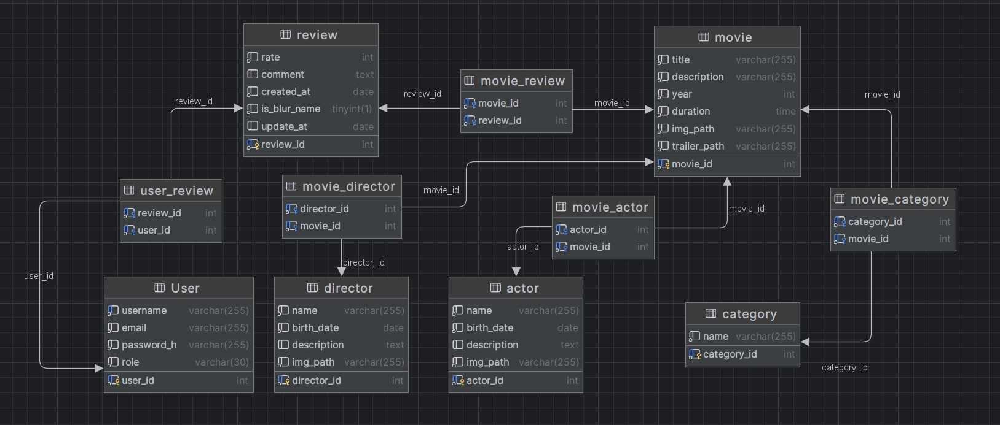

### Login
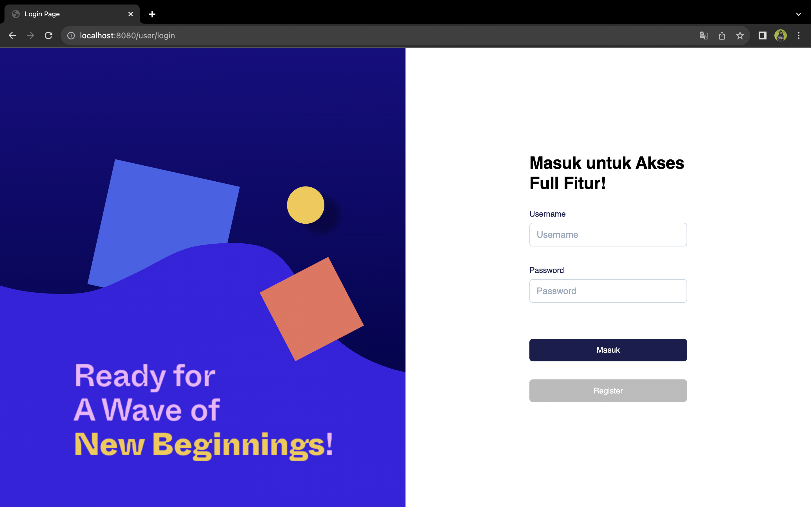

### Register
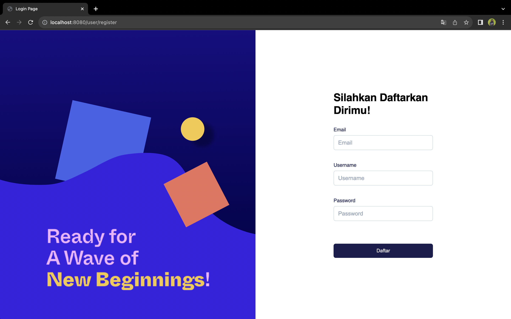

### Home

### Search, Sort, dan Filter

### Daftar Film

### Tambah Film
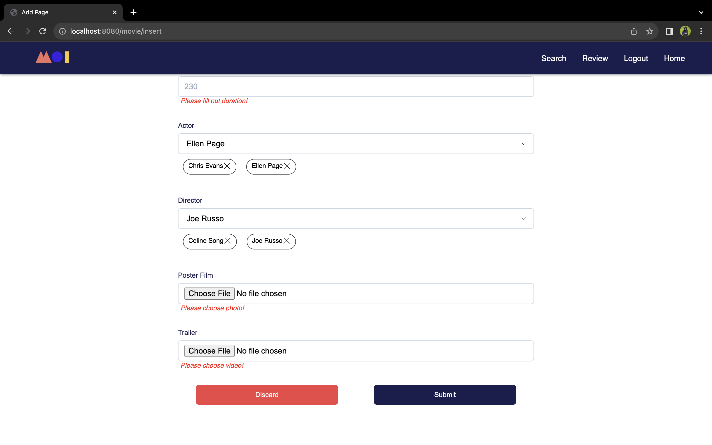
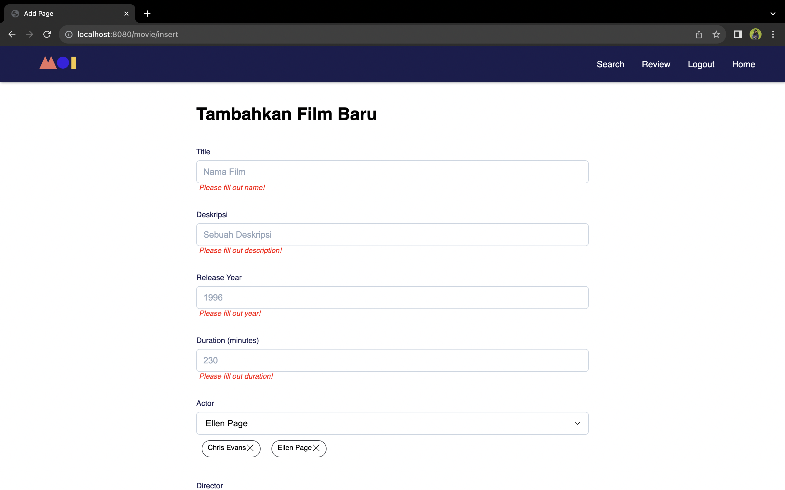

### Edit Film
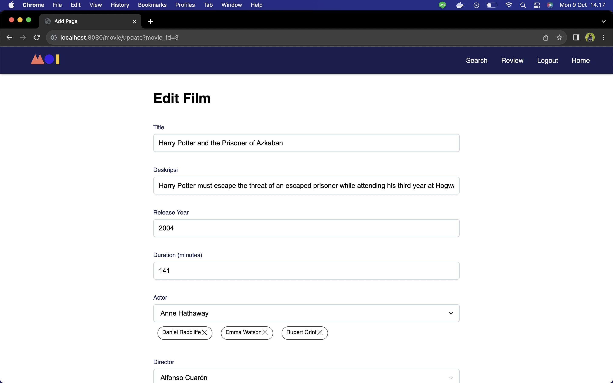

### Detail Film

### Hapus Film

### Daftar Aktor

### Tambah Aktor
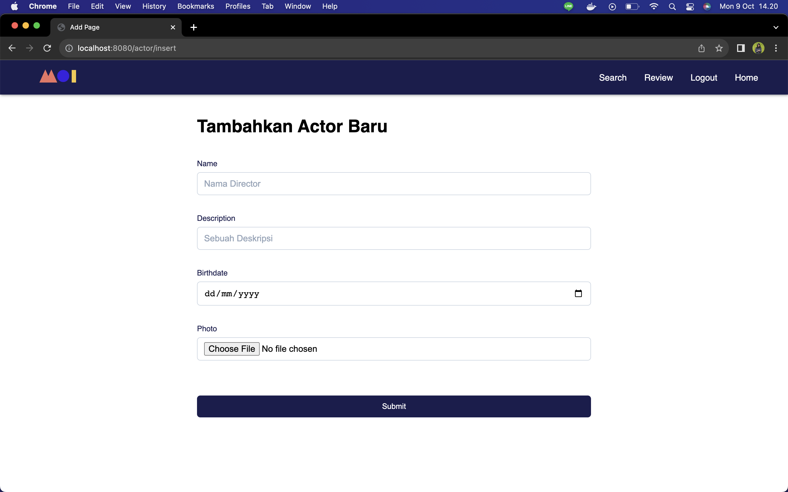

### Edit Aktor
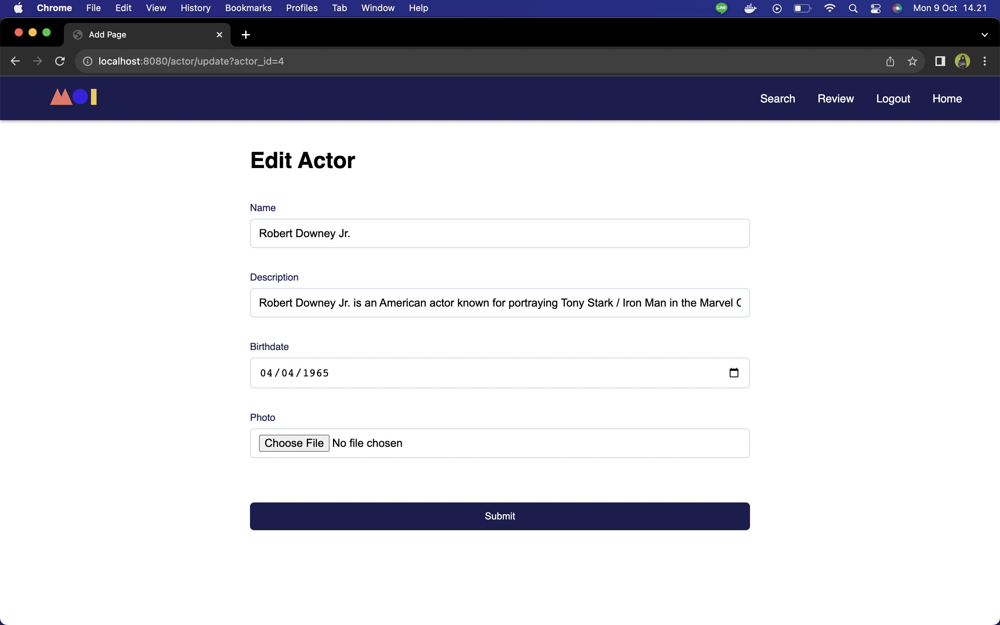

### Detail Aktor

### Hapus Aktor

### Daftar Sutradara

### Tambah Sutradara
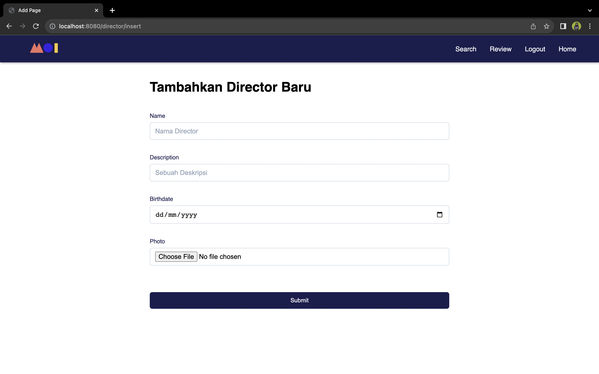

### Edit Sutradara
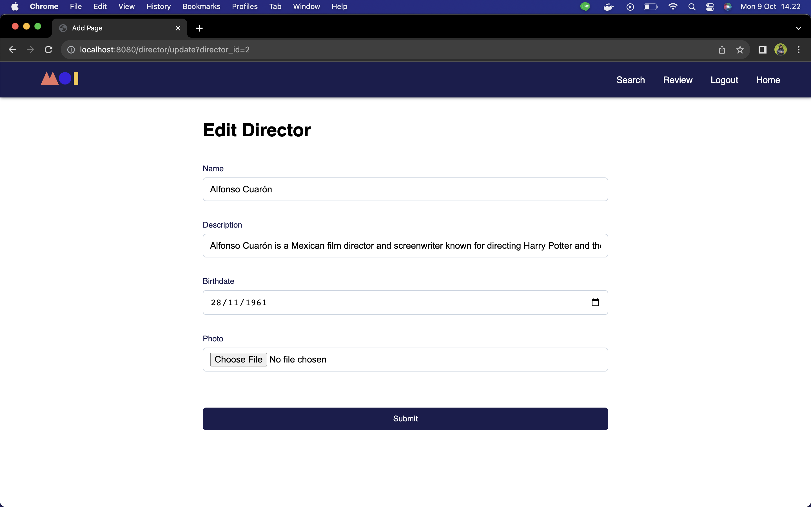

### Detail Sutradara

### Hapus Sutradara
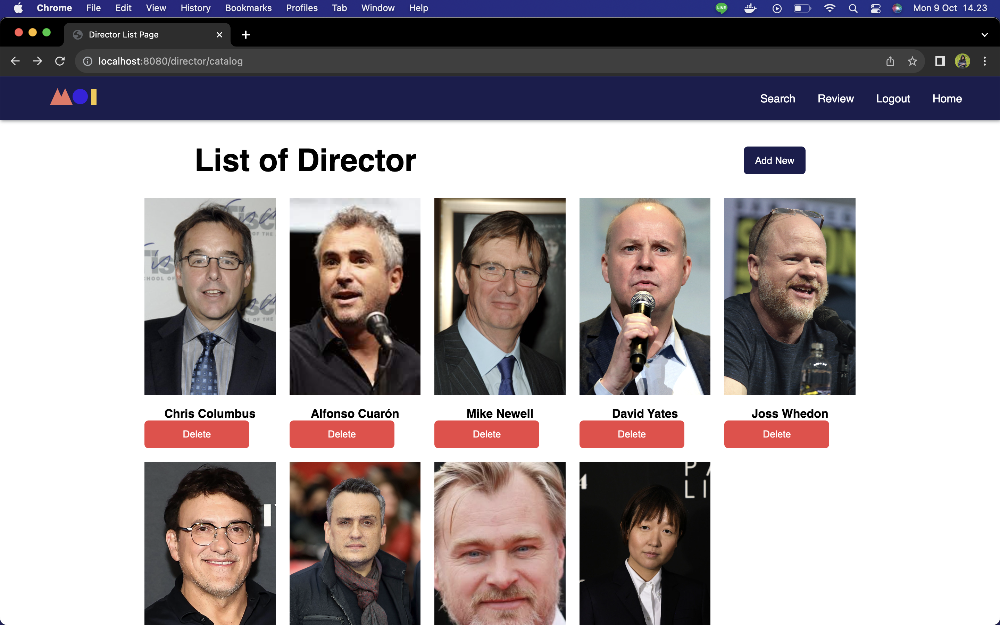

### Daftar Review
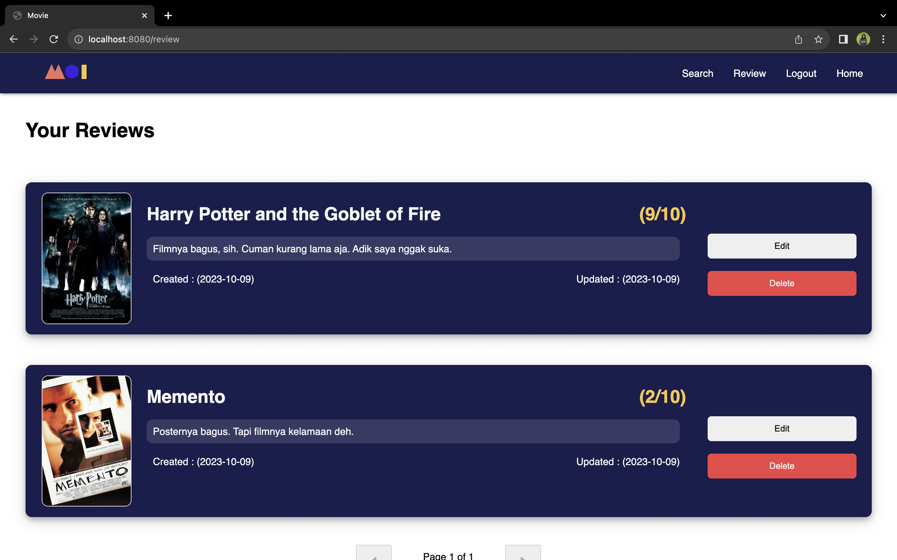

### Tambah Review
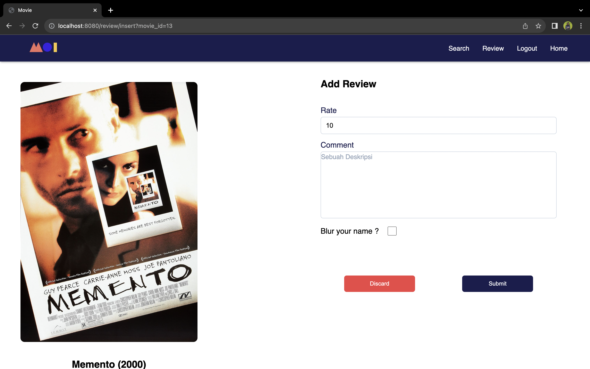

### Edit Review
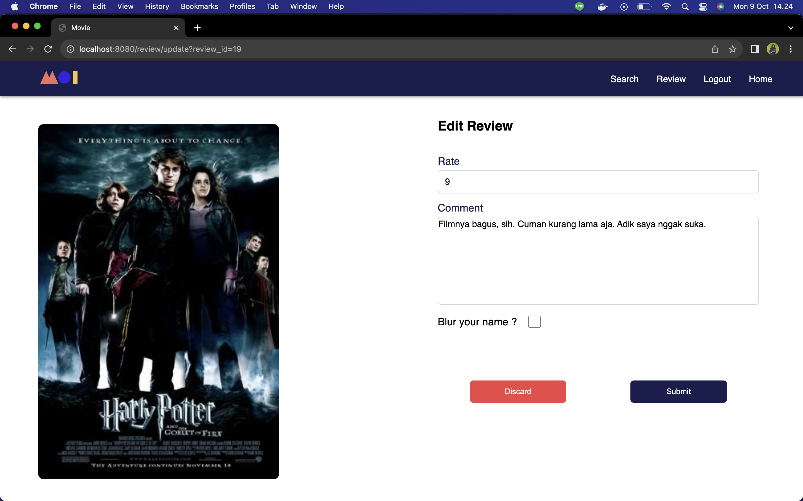

### Hapus Review

### Logout

## Pembagian Tugas

### _Server Side_

| Fitur                       | NIM      |
|-----------------------------|----------|
| 1. Login                    | 13521171 |
| 2. Register                 | 13521171 |
| 3. Home                     | 13521171 |
| 4. Search, Sort, dan Filter | 13521109 |
| 5. Daftar Film              | 13521171 |
| 6. Tambah Film              | 13521171 |
| 7. Edit Film                | 13521067 |
| 8. Detail Film              | 13521067 |
| 9. Hapus Film               | 13521109 |
| 10. Daftar Aktor            | 13521171 |
| 11. Tambah Aktor            | 13521171 |
| 12. Edit Aktor              | 13521067 |
| 13. Detail Aktor            | 13521067 |
| 14. Hapus Aktor             | 13521109 |
| 15. Daftar Sutradara        | 13521171 |
| 16. Tambah Sutradara        | 13521171 |
| 17. Edit Sutradara          | 13521109 |
| 18. Detail Sutradara        | 13521067 |
| 19. Hapus Sutradara         | 13521109 |
| 20. Daftar Review           | 13521109 |
| 21. Tambah Review           | 13521109 |
| 22. Edit Review             | 13521109 |
| 23. Hapus Review            | 13521109 |
| 24. Logout                  | 13521171 |

### _Client Side_

| Fitur                       | NIM      |
|-----------------------------|----------|
| 1. Login                    | 13521109 |
| 2. Register                 | 13521109 |
| 3. Home                     | 13521171 |
| 4. Search, Sort, dan Filter | 13521109 |
| 5. Daftar Film              | 13521171 |
| 6. Tambah Film              | 13521171 |
| 7. Edit Film                | 13521109 |
| 8. Detail Film              | 13521067 |
| 9. Hapus Film               | 13521109 |
| 10. Daftar Aktor            | 13521171 |
| 11. Tambah Aktor            | 13521171 |
| 12. Edit Aktor              | 13521067 |
| 13. Detail Aktor            | 13521109 |
| 14. Hapus Aktor             | 13521109 |
| 15. Daftar Sutradara        | 13521171 |
| 16. Tambah Sutradara        | 13521171 |
| 17. Edit Sutradara          | 13521109 |
| 18. Detail Sutradara        | 13521067 |
| 19. Hapus Sutradara         | 13521109 |
| 20. Daftar Review           | 13521109 |
| 21. Tambah Review           | 13521109 |
| 22. Edit Review             | 13521109 |
| 23. Hapus Review            | 13521109 |
| 24. Logout                  | 13521109 |
